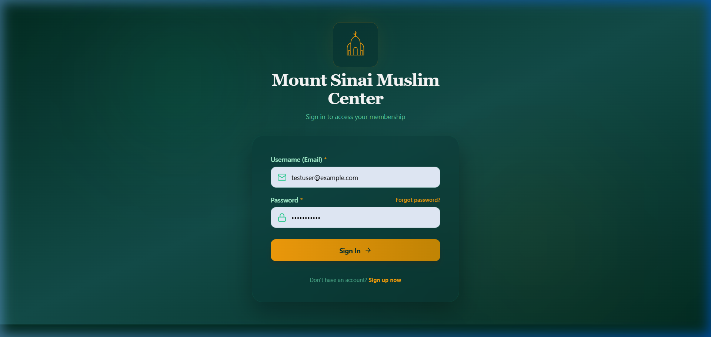
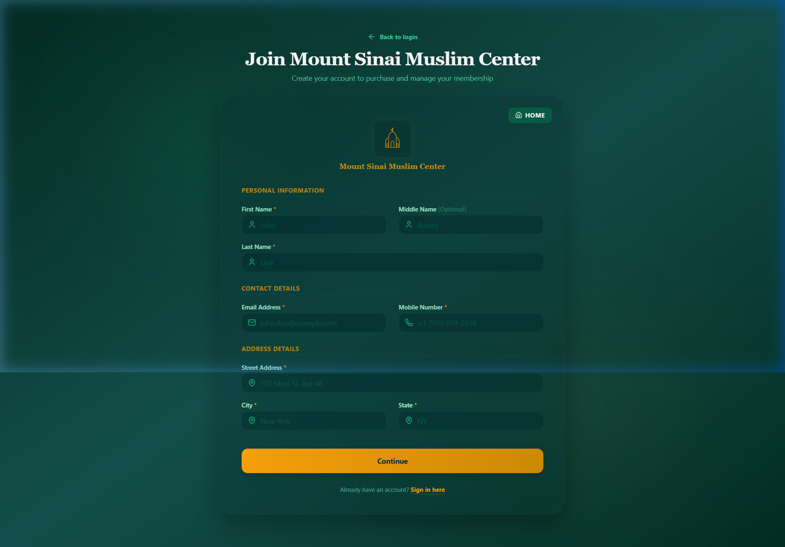
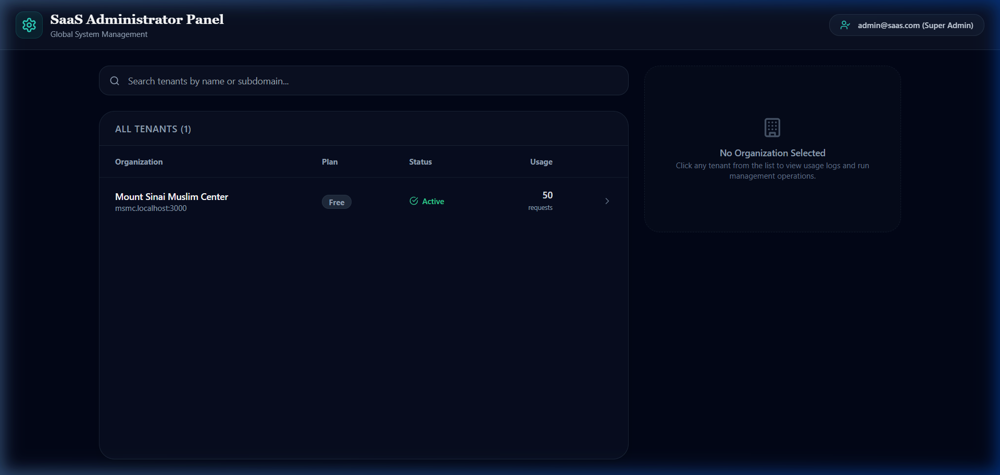
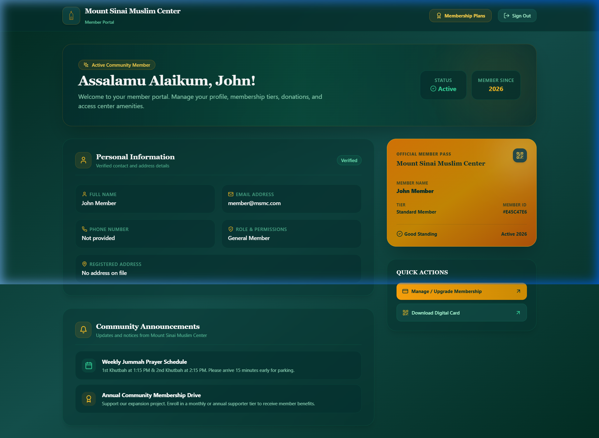

# Multi-Tenant Membership Platform — Functional Walkthrough & Testing Guide

Welcome to the **BlueCraft Multi-Tenant Membership Platform** walkthrough. This document provides a complete functional explanation of all features built across the full-stack application (FastAPI backend and Next.js frontend), accompanied by step-by-step instructions and verified screenshots so you can test and explore every feature locally.

---

## 1. Local Server Runtime Status

Both backend and frontend servers are actively running in your local development environment:

| Service | Local Address | Interactive Documentation / Route | Status |
| :--- | :--- | :--- | :--- |
| **Backend (FastAPI)** | `http://127.0.0.1:8000` | [Swagger UI (Docs)](http://127.0.0.1:8000/docs) · [Health Check](http://127.0.0.1:8000/health) | **ONLINE (Active with Auto-Reload)** |
| **Frontend (Next.js 14)** | `http://localhost:3000` | [Member Portal](http://localhost:3000) · [Super Admin](http://localhost:3000/admin) | **ONLINE (Active)** |
| **Tenant Subdomain** | `http://msmc.localhost:3000` | [MSMC Organization Portal](http://msmc.localhost:3000) | **ONLINE (Active)** |
| **Database** | `backend/dev.db` | Local SQLite fallback with schema translation & auto-seed | **INITIALIZED & SEEDED** |

---

## 2. Quick Reference: Pre-Seeded Test Credentials

Use these pre-seeded accounts stored in `backend/dev.db` for instant local testing:

| Role | Email Address | Password | Target URL | Privileges & Capabilities |
| :--- | :--- | :--- | :--- | :--- |
| **Platform Super Admin** | `admin@saas.com` | `Password123` | [http://localhost:3000/admin](http://localhost:3000/admin) | Global tenant management, plan switching (Free/Pro/Enterprise), suspension toggles, API audit logs, one-click impersonation |
| **Tenant Member** | `member@msmc.com` | `Password123` | [http://localhost:3000/](http://localhost:3000/) or [http://msmc.localhost:3000/](http://msmc.localhost:3000/) | Member dashboard, profile management, verified address, digital membership pass with QR code |

---

## 3. Visual UI Overview

Below are actual verified captures from the active local application:

| Tenant Member Portal | Multi-Step Member Onboarding |
| :---: | :---: |
|  |  |
| *Emerald & Gold Glassmorphic Login with Mosque Dome Emblem* | *Validated 3-Step Contact & Security Onboarding* |

| SaaS Super Administrator Panel | Tenant Member Dashboard |
| :---: | :---: |
|  |  |
| *Global Directory, Quota Controls & Live API Usage Counts* | *Assalamu Alaikum Greeting, Profile Data & Gold Member Pass* |

---

## 4. Comprehensive Feature Explanations & Testing Playbooks

```
+-----------------------------------------------------------------------------------+
|                           BLUECRAFT PLATFORM TOPOLOGY                             |
+-----------------------------------------------------------------------------------+
|                                                                                   |
|  [ Global Super Admin ] ---------> http://localhost:3000/admin                     |
|                                     - Tenant Directory & Quota Controls           |
|                                     - Organization Suspension & Plan Upgrades     |
|                                     - API Usage Analytics & Impersonation          |
|                                                                                   |
|  [ Tenant Subdomain ] -----------> http://[subdomain].localhost:3000              |
|                                     - Islamic-Themed Glassmorphic Portal          |
|                                     - Multi-Step Member Onboarding                |
|                                     - Member Dashboard & Digital Pass             |
|                                     - Tier Checkout & Admin Integrations Hub      |
|                                                                                   |
|  [ FastAPI Backend ] ------------> http://127.0.0.1:8000                          |
|                                     - Subdomain & JWT Context Middleware          |
|                                     - Postgres RLS / SQLite Fallback Hook         |
|                                     - Sliding-Window Rate Limiter & Audit Logger  |
+-----------------------------------------------------------------------------------+
```

---

### Feature 1: Global Super Admin Dashboard (`/admin`)

#### Functional Explanation
The Global Super Admin panel serves as the platform operator's control center. It allows SaaS platform owners to govern all registered organizations, monitor system resources, manage subscriptions, and provide live customer support through session impersonation.

* **Backend Security**: Guarded by the `get_current_super_admin` dependency. Requests without a valid JWT bearing `is_super_admin: true` are rejected with HTTP 403 / 401.
* **RLS Bypass**: Admin endpoints query database records globally across all tenants by setting `bypass_rls = True`.
* **Dynamic Search & Filtering**: Instant client-side search across organization names and subdomains.
* **Live Plan Upgrades & Downgrades**: Switching an organization between **Free**, **Pro**, and **Enterprise** instantly alters their database record and updates their sliding-window API rate limits (100 req/min, 1,000 req/min, or 1,000,000 req/min).
* **Tenant Suspension Switch**: Toggling status between `active` and `suspended` immediately prevents tenant users from authenticating.
* **API Usage & Audit Logging**: Real-time tracking of HTTP requests sent by each tenant, including timestamp, HTTP method, route path, and status code.
* **Support Impersonation**: Generates a cryptographically signed tenant member token and redirects the admin directly into the tenant's dashboard as that user without requiring their password.

#### Step-by-Step Testing Playbook

1. **Log in to Admin Panel**:
   * Open your browser and navigate to: [http://localhost:3000](http://localhost:3000)
   * Enter email: `admin@saas.com`
   * Enter password: `Password123`
   * Click **Sign In**. Once logged in, navigate to [http://localhost:3000/admin](http://localhost:3000/admin).
2. **Inspect the Tenant Directory**:
   * You will see **Mount Sinai Muslim Center** (`msmc.localhost:3000`) listed in the table.
   * Observe the metrics: Status (`Active`), Plan (`Free`), Rate Limit (`100 req/min`), and Total Usage count.
3. **Test Changing Subscription Plans**:
   * Click the **Free** plan badge to change it to **Pro** or **Enterprise**.
   * Notice the confirmation alert: *"Plan updated to PRO successfully"*.
   * Verify that the rate limit threshold updates to `1,000 req/min` (or `1,000,000 req/min` for Enterprise).
4. **Test Suspending & Reactivating a Tenant**:
   * Click the **Active** status toggle button.
   * Confirm the status switches to **SUSPENDED**.
   * Click the button again to reactivate the tenant back to **ACTIVE**.
5. **Inspect Detailed Audit Logs**:
   * Click the row next to **Mount Sinai Muslim Center**.
   * A side drawer will open displaying organization details and the last 100 HTTP requests logged for that tenant, showing endpoint paths (e.g. `/api/v1/auth/me`, `/api/v1/users`), HTTP methods, and status codes.
6. **Test Support Impersonation**:
   * Click the **Impersonate Organization** button.
   * The backend generates a support token and redirects you to `http://msmc.localhost:3000/dashboard`, logged in with that tenant's user session.

---

### Feature 2: Organization Member Portal & Subdomain Routing

#### Functional Explanation
The tenant entry point provides a customized branded experience for non-profit community members. 

* **Next.js Subdomain Rewriting (`frontend/src/middleware.ts`)**:
  * Visiting `http://msmc.localhost:3000/` automatically rewrites the request internally to dynamic route `/app/msmc`.
  * Visiting the base domain `http://localhost:3000/` safely falls back to the default `msmc` tenant.
  * Visiting `http://localhost:3000/admin` rewrites to `/app/admin`.
* **Aesthetic Islamic Mosque UI**:
  * Designed with emerald green, deep teal, and warm amber-gold highlights.
  * Features a custom vector mosque dome emblem, subtle radial glows, and responsive glassmorphic cards.
* **Security & Token Management**:
  * Authenticates using OAuth2 Password Flow (`POST /api/v1/auth/login`).
  * Emits access tokens with embedded `tenant_id` claims, ensuring that queries are strictly scoped to the tenant's data boundary.
* **Forgot Password Flow**:
  * Built-in interactive tab to request a credential reset email with instantaneous validation feedback.

#### Step-by-Step Testing Playbook

1. **Access the Member Portal**:
   * Navigate to [http://localhost:3000](http://localhost:3000) or [http://msmc.localhost:3000](http://msmc.localhost:3000).
   * Observe the title: **Mount Sinai Muslim Center**.
2. **Test Error Handling**:
   * Type `wrong@email.com` and password `wrongpass`.
   * Click **Sign In**.
   * Verify the alert banner appears: *"Incorrect email or password"*.
3. **Test Successful Member Login**:
   * Enter email: `member@msmc.com`
   * Enter password: `Password123`
   * Click **Sign In**.
   * Notice the green confirmation message *"Login successful! Redirecting..."* and smooth transition to the dashboard.
4. **Test Password Reset Form**:
   * On the login page, click **Forgot password?**.
   * Input your email address and click **Send Reset Instructions**.
   * Confirm the instructional notification appears.

---

### Feature 3: Multi-Step Member Onboarding (`/signup`)

#### Functional Explanation
The member signup flow allows new community members to register under a tenant organization. The registration is split into clear, validated steps to maximize completion rates:

* **Step 1: Contact & Physical Address**:
  * Inputs: First Name, Middle Name (optional), Last Name, Street Address, City, State, Mobile Number, Email Address.
  * Validation: Strict regex checking for mobile phone numbers (`/^\+?[\d\s-]{7,15}$/`) and RFC-compliant email formatting.
* **Step 2: Security & Password**:
  * Inputs: Password and Confirm Password.
  * Validation: Enforces minimum 8-character length and exact match verification.
* **Step 3: Account Creation & Confirmation**:
  * Dispatches `POST /api/v1/auth/register` scoped with the `X-Tenant-Subdomain` header.
  * Hashes passwords using bcrypt.
  * Presents an onboarding success screen with a direct link to sign in.

#### Step-by-Step Testing Playbook

1. **Navigate to the Signup Page**:
   * On the login screen, click **Sign up now** or go directly to [http://localhost:3000/signup](http://localhost:3000/signup).
2. **Fill Out Step 1 (Personal Information)**:
   * First Name: `Tariq`
   * Last Name: `Mansoor`
   * Street Address: `786 Peace Way, Apt 2B`
   * City: `Chicago`
   * State: `IL`
   * Mobile Number: `+1 555-019-2834`
   * Email Address: `tariq.mansoor@example.com`
   * Click **Continue to Security**.
3. **Fill Out Step 2 (Password)**:
   * Password: `SecurePassword123`
   * Confirm Password: `SecurePassword123`
   * Click **Complete Registration**.
4. **Verify Step 3 (Success)**:
   * Notice the green checkmark screen confirming registration.
   * Click **Sign In to Your Account**.
   * Log in using `tariq.mansoor@example.com` and `SecurePassword123` to verify that your new account is active and immediately functional.

---

### Feature 4: Member Portal Dashboard & Digital Membership Pass (`/dashboard`)

#### Functional Explanation
The member portal gives users full visibility into their membership profile, digital credentials, and community announcements:

* **Personalized Greeting**: Displays the user's first name, membership status badge, and the year they joined.
* **Verified Profile Card**: Read-only display of personal information including verified email, telephone number, role permissions, and full street address fetched live from `/api/v1/auth/me`.
* **Gold Digital Membership Pass**:
  * High-contrast amber-gold metallic pass with mosque watermark.
  * Displays the organization name, member's full name, membership tier (*Standard Member*), active standing badge, and unique 8-character Member ID.
  * Integrated QR Code visual identifier for center check-ins.
* **Community Announcements Feed**:
  * Displays community updates such as Friday Jummah prayer schedules (1st & 2nd Khutbah timings) and membership drive notifications.
* **Session Management**:
  * Top navigation bar with instant **Sign Out** button that cleanses localStorage tokens and safely redirects back to the login portal.

#### Step-by-Step Testing Playbook

1. **Open the Dashboard**:
   * Navigate to [http://localhost:3000/dashboard](http://localhost:3000/dashboard) (logged in as `member@msmc.com` or your newly created user).
2. **Verify User Profile**:
   * Confirm your name (**John Member**), email, address, and role (*General Member*) match your credentials.
3. **Inspect the Digital Membership Pass**:
   * Locate the gold card in the right column.
   * Check that your full name and member ID (e.g. `#E45C47E6`) are rendered accurately.
4. **Test Quick Actions**:
   * Click **Manage / Upgrade Membership** to transition to the plans checkout page.
5. **Test Sign Out**:
   * Click **Sign Out** in the top right header.
   * Verify that your token is removed from local storage and the browser redirects to the login screen.

---

### Feature 5: Multi-Tenant Instant Organization Onboarding (`/api/v1/auth/register-tenant`)

#### Functional Explanation
Allows new non-profit organizations to sign up for the platform self-service. In a single atomic database transaction:
1. Validates subdomain uniqueness globally.
2. Checks email uniqueness across all organizations.
3. Inserts a new `Tenant` record with default `free` plan and active status.
4. Sets the tenant context and registers the organization's initial administrative user with `is_superuser = True`.

#### Step-by-Step Testing Playbook (via cURL)

You can create a brand new organization (e.g., `alnoor`) right from your terminal:

```powershell
curl.exe -X POST "http://127.0.0.1:8000/api/v1/auth/register-tenant" `
  -H "Content-Type: application/json" `
  -d '{"company_name": "Al-Noor Community Center", "subdomain": "alnoor", "email": "director@alnoor.org", "password": "Password123", "first_name": "Tariq", "last_name": "Mansoor", "mobile": "+15551234567", "street_address": "456 Peace Way", "city": "Chicago", "state": "IL"}'
```

* **Verify in Super Admin**: Refresh [http://localhost:3000/admin](http://localhost:3000/admin); **Al-Noor Community Center** will immediately appear in the tenant list with its own dedicated subdomain `alnoor`.

---

### Feature 6: Governance, Quotas & API Auditing

#### Functional Explanation
* **Sliding-Window Rate Limiter (`backend/app/services/rate_limiter.py`)**:
  * Prevents any single tenant from overloading the database or API.
  * Tracks requests over a 60-second sliding window.
  * Automatically switches between Redis (if available) and an in-memory queue fallback.
  * When a tenant exceeds their plan threshold, the API responds with HTTP 429:
    ```json
    {"detail": "Too Many Requests. Rate limit exceeded for your plan."}
    ```
* **Per-Tenant Usage Auditing**:
  * Every API request passing through `tenant_context_middleware` (except `/health`) records a `UsageEvent`.
  * Logs the tenant UUID, path, HTTP method, and HTTP status code.
  * These events are queryable by super admins to inspect tenant API traffic and charge overages if applicable.
* **PostgreSQL Statement Timeout**:
  * In production PostgreSQL, transactions run `SELECT set_config('statement_timeout', '5000', true);`. Any runaway query running longer than 5 seconds is aborted by the database engine to protect multi-tenant performance.

#### Step-by-Step Testing Playbook

1. Send several requests to the backend:
   ```powershell
   curl.exe -s http://127.0.0.1:8000/api/v1/users/ -H "X-Tenant-Subdomain: msmc"
   ```
2. Open [http://localhost:3000/admin](http://localhost:3000/admin).
3. Check the **Usage** counter next to `msmc`; notice the number increment with every request made.

---

### Feature 7: Tenant Admin & Integrations Hub (`/[tenant]/admin` and `/[tenant]/checkout`)

#### Functional Explanation
* **Tenant Admin Portal (`/app/[tenant]/admin`)**:
  * Dedicated settings page for tenant administrators.
  * Integrations hub for **Salesforce** (member CRM synchronization via `simple-salesforce`) and **Stripe** (subscription collection via Stripe Connect).
* **Membership Checkout Page (`/app/[tenant]/checkout`)**:
  * Displays available supporter tiers:
    * **Basic Member** ($10/month) — General community access.
    * **Premium Member** ($25/month) — Premium events, directories, and facility perks.
  * Connects with `StripeService.create_checkout_session` to facilitate online member payments.

#### Step-by-Step Testing Playbook

1. Navigate to [http://localhost:3000/app/msmc/admin](http://localhost:3000/app/msmc/admin).
2. Review the Salesforce and Stripe integration panels.
3. Navigate to [http://localhost:3000/app/msmc/checkout](http://localhost:3000/app/msmc/checkout) to preview the membership subscription plans.

---

## 5. Architecture & Implementation Highlights

```
                      ┌─────────────────────────────────────────┐
                      │              Incoming Request           │
                      └────────────────────┬────────────────────┘
                                           │
                        ┌──────────────────▼──────────────────┐
                        │   Next.js Middleware (Port 3000)    │
                        │   - Extracts Host / Subdomain       │
                        │   - Rewrites to /app/[tenant]/*     │
                        └──────────────────┬──────────────────┘
                                           │
                        ┌──────────────────▼──────────────────┐
                        │    FastAPI Gateway (Port 8000)      │
                        │    - tenant_context_middleware      │
                        │    - Resolves Tenant ID via Subdomain│
                        │      or Decoded JWT Payload         │
                        └──────────────────┬──────────────────┘
                                           │
                        ┌──────────────────▼──────────────────┐
                        │       Sliding-Window Limiter        │
                        │       Checks rate_limit_per_minute  │
                        └──────────────────┬──────────────────┘
                                           │
                        ┌──────────────────▼──────────────────┐
                        │    SQLAlchemy Async Session Hook    │
                        │    - Sets app.current_tenant_id     │
                        │    - Sets app.bypass_rls            │
                        │    - Statement timeout (5000ms)     │
                        └──────────────────┬──────────────────┘
                                           │
                        ┌──────────────────▼──────────────────┐
                        │   Database (Postgres RLS / SQLite)  │
                        │   Isolates Users, Tiers, & Events   │
                        └─────────────────────────────────────┘
```

---

## 6. Server Management & Maintenance Cheatsheet

If you ever need to restart or inspect the servers, use the following commands from PowerShell:

### Check Running Server Status
```powershell
# Check if backend (8000) or frontend (3000) are active
Get-NetTCPConnection -LocalPort 8000, 3000 -ErrorAction SilentlyContinue
```

### Starting Backend Server Manually
```powershell
cd E:\Coding-related\BlueCraft\backend
.\venv\Scripts\activate
uvicorn app.main:app --host 127.0.0.1 --port 8000 --reload
```

### Starting Frontend Server Manually
```powershell
cd E:\Coding-related\BlueCraft\frontend
npm run dev
```

### Inspect Database Directly
```powershell
cd E:\Coding-related\BlueCraft\backend
.\venv\Scripts\python -c "import sqlite3; con = sqlite3.connect('dev.db'); print('Tenants:', con.execute('SELECT name, subdomain, plan FROM tenants').fetchall())"
```

---

*Walkthrough documentation generated and verified with live servers running on `http://localhost:3000` and `http://127.0.0.1:8000`.*
